SmartISSPosts
==============================


## Goal

Goal of this project was to exploit my ISS database picture, coming from my [ISS-HDEV-wallpaper project](https://github.com/prise6/ISS-HDEV-wallpaper). These pictures was taken from the ISS HDEV live. Most of them was posted on [instagram](https://www.instagram.com/earthfromiss/). I decided to cluster images in order to identify which images could be cool to post or to find out which cluster are ugly ...

Unfortunately, HDEV stopped sending any data on July 18, 2019, it was declared, on August 22, 2019, to have reached its end of life... :'( 

My new goal aim to create nice poster composed of different kind of cluster i found. 

<p><small>Project based on the <a target="_blank" href="https://drivendata.github.io/cookiecutter-data-science/">cookiecutter data science project template</a>. #cookiecutterdatascience</small></p>

## Poster examples

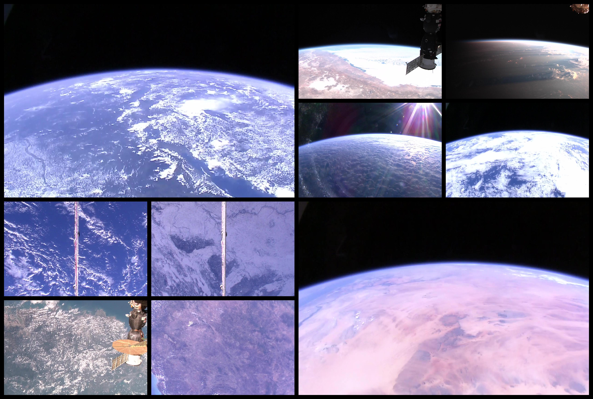
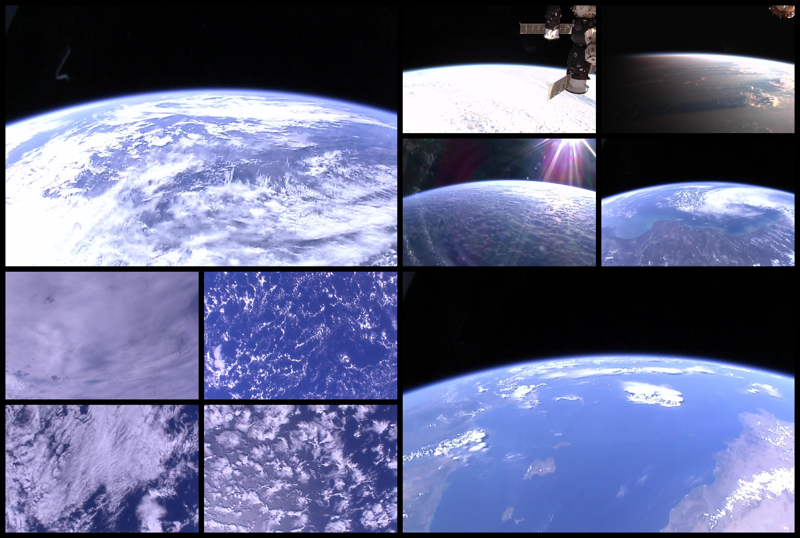
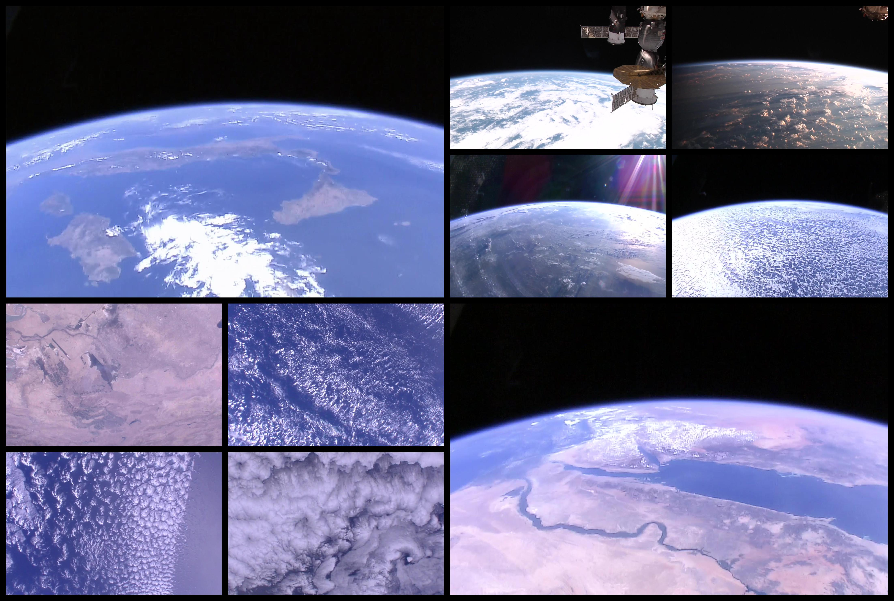


## Environment

I use docker, see `docker-compose.yaml` file. Most of my routines are in `Makefile` file.

#### Manage containers
```
make docker_start
make docker_stop
```

#### Inside jupyter container

I usually start a console inside my jupyter container (tensorflow jhub)
```
make docker_bash
```

And then, initialize environment
```
make requirements
```

I use visual studio code outside my container. To execute some code, i use console and type for example:

```
python -m iss.exec.bdd
# or
make populate_db
```

To use vscode debug, i use *ptvsd*
```
make debug src.exec.bdd
```

#### Config

Configuration file of project is in `config/config_<env>.yaml`. See template in source.

#### .env

Root directory contains a `.env` file with some environment variables

```
MODE=dev
PROJECT_DIR="/home/jovyan/work"
```

The `MODE` value will load `config/config_MODE.yaml` configuration. See `iss/tools/config.py`.

## Steps

### Synchronize images

ISS images are stored online on personal server, i need to collect all of them (>14k images).

```
make sync_collections
```

i used `data/raw/collections` directory.

i have an history of location of ISS for some images, i store it in `data/raw/history/history.txt`

```
12.656456313474;-75.371420423828;20180513-154001;Caribbean Sea
-43.891574367708;-21.080797293704;20180513-160001;South Atlantic Ocean
-10.077472167643;-82.562993796116;20180513-172001;South Pacific Ocean
-51.783078834111;-3.9925568092913;20180513-174001;South Atlantic Ocean
27.255631526786;-134.89231579188;20180513-184001;North Pacific Ocean
```

See extract of `config/config_dev.yml`:

```{yaml}
directory:
  project_dir: ${PROJECT_DIR}
  data_dir: ${PROJECT_DIR}/data
  collections: ${PROJECT_DIR}/data/raw/collections
  isr_dir: ${PROJECT_DIR}/data/isr
```

### Populate DB

I use mysql database running in container to store in table :

* locations: history file
* embedding: clustering results

```
make populate_db
```

*adminer is running to monitor mysql db*

### Sampling images

My clustering consist in using auto encoder to define a latent representation of my images. Latent representation are then use in a classical clustering.

I split into train, test and validation set

```
make sampling
```

See extract of `config/config_dev.yml`:

```{yaml}
sampling:
  autoencoder:
    seed: 37672
    proportions:
      train: 0.7
      test: 0.2
      valid: 0.1
    directory:
      from: collections
      base: ${PROJECT_DIR}/data/processed/models/autoencoder
      train: ${PROJECT_DIR}/data/processed/models/autoencoder/train/k
      test: ${PROJECT_DIR}/data/processed/models/autoencoder/test/k
      valid: ${PROJECT_DIR}/data/processed/models/autoencoder/valid/k
```

### Training auto-encoder

Newbie here, i tried home made models:

* simple auto encoder: `iss/models/SimpleAutoEncoder.py`
* simple convolutional auto encoder: `iss/models/SimpleConvAutoEncoder.py` **<- model selected**
* Variational auto encoder: `iss/models/VariationalAutoEncoder.py`
* Variational convolutional auto encoder: `iss/models/VariationaConvlAutoEncoder.py`


See extract of `config/config_dev.yml`:

```
models:
  simple_conv:
    save_directory: ${PROJECT_DIR}/models/simple_conv
    model_name: model_dev
    sampling: autoencoder
    input_width: 48
    input_height: 27
    input_channel: 3
    latent_width: 6
    latent_height: 3
    latent_channel: 16
    learning_rate: 0.001
    epochs: 2
    batch_size: 128
    verbose: 0
    initial_epoch: 0
    workers: 1
    use_multiprocessing: false
    steps_per_epoch: 4
    validation_steps: 2
    validation_freq: 
    activation: sigmoid
    callbacks:
      csv_logger:
        directory: ${PROJECT_DIR}/models/simple_conv/log
        append: true
      checkpoint:
        directory: ${PROJECT_DIR}/models/simple_conv/checkpoint
        verbose: 1
        period: 20
      tensorboard:
        log_dir: ${PROJECT_DIR}/models/simple_conv/tensorboard
        limit_image: 5
      floyd: True
```

I create simple training framework and launch it with:

```
make training
# or
python -m iss.exec.training --model-type=simple_conv 
```

Actually, i use [floydhub](https://www.floydhub.com/) to train my models.

i added a `floyd.yml` file in root directory containing something like this:

```
env: tensorflow-1.12
task:
  training:
    input:
      - destination: /iss-autoencoder
        source: prise6/datasets/iss/1
    machine: gpu
    description: training autoencoder (simple_conv)
    command: mv .env-floyd .env && make training

  training_prod:
    input:
      - destination: /iss-autoencoder
        source: prise6/datasets/iss/1
    machine: gpu2
    description: training autoencoder (simple_conv)
    command: mv .env-floyd .env && make training
```

i use a special config file for floydhub so i provide a different `.env` file.

Training dashboard and dataset are public and available [here](https://www.floydhub.com/prise6/projects/smart-iss-posts/22) 

```
make floyd_training_prod
```

I tested google colab and train the final model with it, but result are really similar to the floydhub model.

### Clustering

Having fun with different approachs:

* Classical Clustering (PCA + kmeans + Hierarchical clustering): `iss/clustering/ClassicalClustering.py`
* Advanced Clustering: `iss/clustering/AdvancedClustering.py` (no really used)
* Not2Deep Clustering (see [paper](https://github.com/rymc/n2d)): `iss/clustering/N2DClustering.py` 
**<- selected**
* DbScan Clustering: `iss/clustering/DBScanClustering.py` (no really used)

Clustering are trained onver a sample ~2.5k images. I create 50 clusters in order to find clusters with very similar images. 

```
make exec_clustering
```

Parameters are in `config/config_dev.yml`:

```{yaml}
clustering:
  n2d:
    version: 3
    model:
      type: 'simple_conv'
      name: 'model_colab'
    umap:
      random_state: 98372
      metric: euclidean
      n_components: 2
      n_neighbors: 5
      min_dist: 0
    kmeans:
      n_clusters: 50
      random_state: 883302
    save_directory: ${PROJECT_DIR}/models/clustering/n2d
```


#### Embeddings

I save umap/t-sne embedding of latent space to plot it with bokeh: 

*(screenshot)*
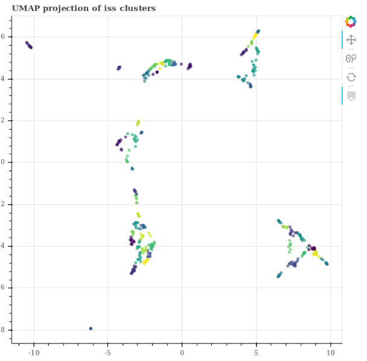

I populate my embedding mysql table with `iss/exec/bdd.py` script

#### Silhouette

Compute silhouette score on latent representation for every cluster to see quality.

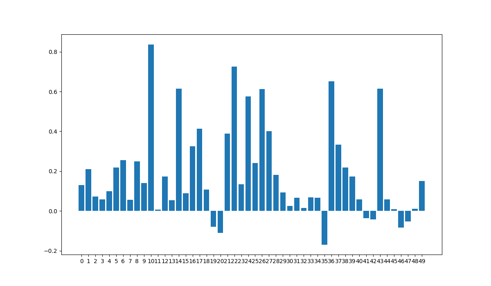


#### Mosaic plot

Example of 0.2 silhouette score (cluster 1):

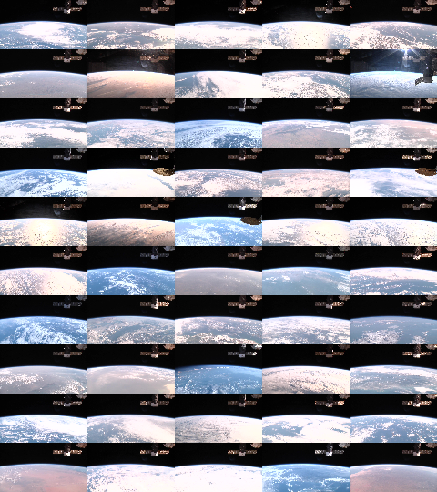

Another example of 0.2 silhouette score (cluster 39):

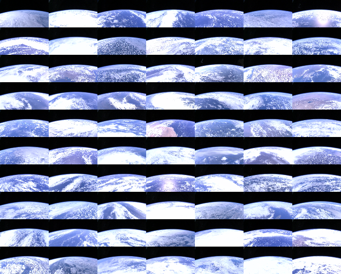

We see why it's low, but we detect the pattern why it's gathered.

Example of 0.8 silhouette score (cluster 10):


live is off, easy to cluster.

Example of negative silhouette score (cluster 35):

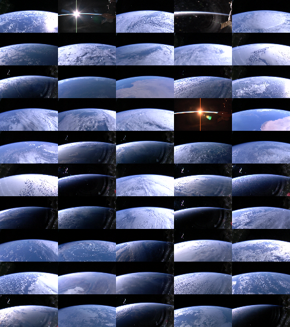

A bit messy.

See all mosaic cluster on [imgur](https://earthfromiss.imgur.com/all/).

#### Facets

Let's try [facets](https://pair-code.github.io/facets/) on this dataset ! Thanks to mysql db i can compare different clustering and visualize it with facets-dive.

```
make facets
```

Two html page are created in the directory `reports/`.

You can manipulate all your images:

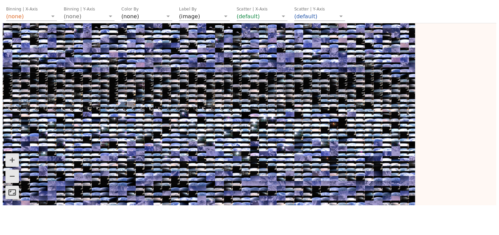

Bin by cluster:

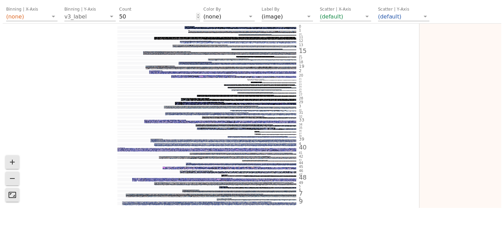

And zoom on it:

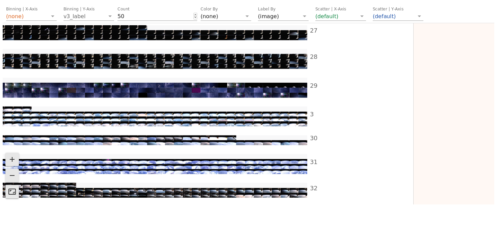

It's a bit messy because you cannot filter your data  ... but the sprite trick make it fast!


### Posters

Generate multiple posters based on a template.
See poster examples on top.

```
make posters
```

## Personal Note:

original size : 1280x720
cut size : 48x27

inch = 2.54cm 
150dpi
300dpi
http://www.altelia.fr/actualites/calculateur-resolution-definition-format.htm
https://fr.wikipedia.org/wiki/Point_par_pouce


2880px X 4320px
donne : (en 150 dpi)

48.77cm x 73.15cm

bordure de 60px pour 1 cm en 150dpi

version2 : 

* e63e25b
* df89064
* d4cb94
* c2ff00
* 2e58ed9 : ok
* 2b11acbe
* 2575f6
* 1b4cb13: ok